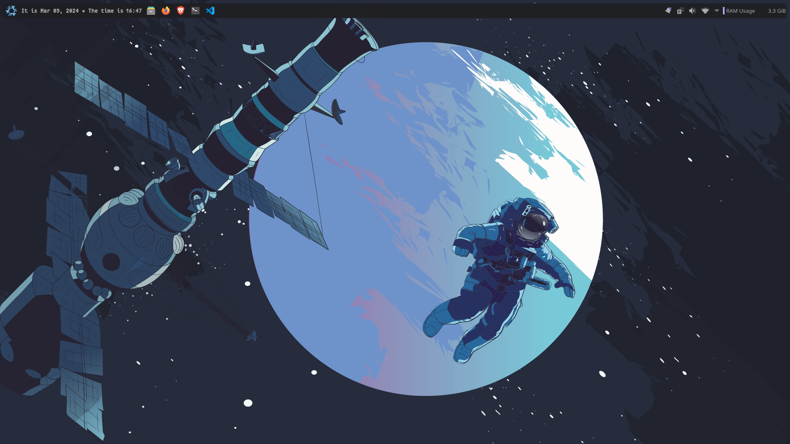
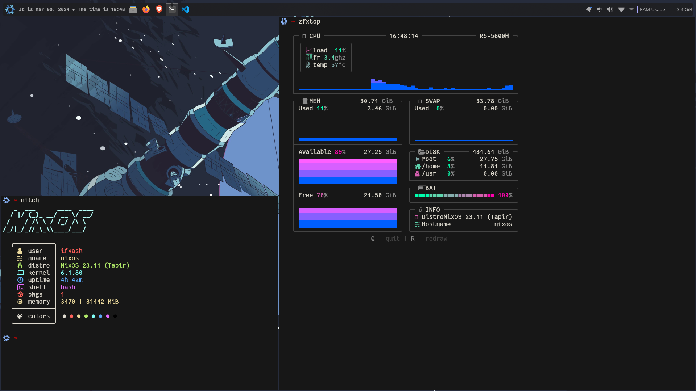

# My dotfiles

Well, these are my dotfiles (a few of them, atleast!). Reference video here: [Dreams of Autonomy](https://youtu.be/y6XCebnB9gs)

## Tools needed
**`git`**
```sh
paru -S git
```

**`stow`**
```sh
paru -S stow
```

## Install
1. Clone the repo
```sh
git clone git@github.com:kashifulhaque/dotfiles.git ~/dotfiles
```
2. Go inside the `dotfiles` directory
```sh
cd ~/dotfiles
```
3. Use stow to bring up the changes
```sh
stow --adopt .
```

## Screenshots



## Wallpaapers
[Wallpapers here](./Pictures/Wallpapers)